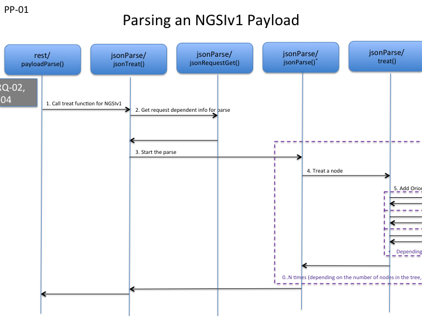

The library jsonParse contains two overloaded functions with the name **jsonParse**.
The first one is the toplevel function that is called only once per reqeust.
The second jsonParse (invoked by the first) on the other hand is invoked recursively once per node in the parsed tree that
is output from *Boost property_tree*.
The concrete example used for this image is the parsing of payload for POST /v1/updateContextRequest

_Figure PP-01_  

* payloadParse calls the NGSIv1 parse function for JSON payloads (which is one of three possible parse functions to call – parsing of NGSIv1 JSON, NGSIv2 JSON and TEXT)
* In point 2 in the figure, `jsonTreat` looks up the type of request by calling jsonRequestGet(), which returns a pointer to a
  JsonRequest struct that is needed to parse the payload (and then initiates the parse by calling jsonParse()).
    Each type of payload needs different input to the common parsing routines.
    A vector of JsonRequest structs contains this information and this function (jsonRequestGet) looks up the corresponding JsonRequest struct 
    in the vector and returns it. More on the JsonRequest struct later.
* Knowing the specific information for the request type, jsonTreat calls the toplevel jsonParse(), whose responsibility is to start the parsing of the payload  (point 3 in figure).
* jsonParse()* reads in the payload into a stringstream and calls the function json_read that takes care of the parsing of the payload  (point 4 in figure).
    After that, the lower level jsonParse is invoked on the resulting tree to convert the boost property tree into an Orion structure.
    Which Orion structure depends on the request type.
    jsonParse()* is a recursive function that calls the treat() function on each node and if the node is not a leaf,
    does an recursive call to itself for each child of the node.
    The treat() function checks for forbidden characters in the payload and then …
* ... calls the specific Parse-Function for the node in question  (point 5 in figure).
    A pointer to this specific Parse-Function is found in the struct JsonRequest, as well as the path to each node, which is how the struct is found.
    The Parse-Function simply extracts the information from the tree node and adds it to the resulting Orion struct that is the result of the entire parse.
    Note that each node in the tree has its own Parse-Function and that in this image just a few selected Parse-Functions are shown
    (in fact, to parse this UpdateContextRequest payload, there are no less than 19 Parse-Functions – see jsonParse/jsonUpdateContextRequest.cpp)
* jsonParse()* is called recursively for each child of each node (point 6 in figure)
